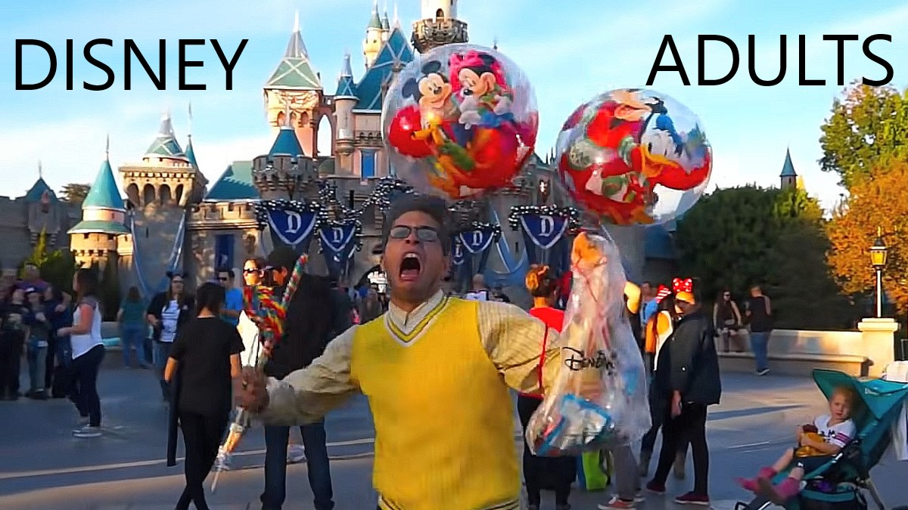

### Hi there 👋, my name is Austin  
 
I am a senior studying math and computer science at the **University of     California San Diego**. I really enjoy learning languages and frameworks like React.    

Skills:   
1. REACT    
2. JS    
3. JAVA    
4. C++    
5. C    
  

My favorite language is c++, and my least favorite is java. I would be fine   with never typing `public static void main(String[] args)` again.     

> I am a big fan of themeparks, I mean who can resist the magic of disney.  
If you also like disney check out [Best Disney News Channel](https://www.youtube.com/channel/UCRDgYztYctlZ5Z2dN9CW49w)  
  

The best California themeparks in order (top being the best bottom worse) IMOP :  
- Disneyland
- California Adventure  
- Six Flags Magic Mountain  
- Universal Studios  
- Knotts Berry Farm  
- California Great America  
- Six Flags Discover Kingdom  

## Who is better, kanye or drake ?   
- [x] Ye  
- [ ] Drizzy  

[check out this other page](other-file.md)

# Congrats you made it to the end of the page

[click here to go the top](#hi-there--my-name-is-austin)